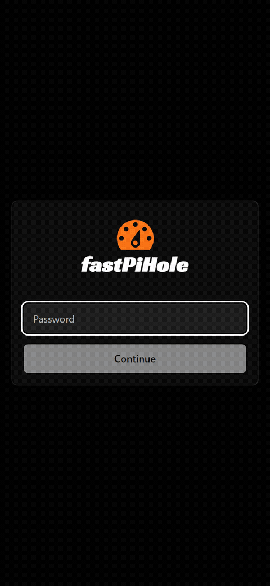

# fastPiHole



Local dashboard to control Pi-hole: global on/off filtering, per-device
DNS blocking, and real-time stats. React + Vite + Tailwind + shadcn/ui
on the frontend, Express as an authenticated backend/proxy to the
Pi-hole v6 API.

## Features

- Global filtering on/off with a single button
- Per-device DNS block/unblock, with persistent memory of the
  device's original Pi-hole group (supports custom groups like
  parental controls — see [Per-device blocking](#per-device-blocking))
- Real-time stats (queries, blocked, block rate)
- Password authentication with server-side sessions
- Dark-first monochrome design; green/orange reserved only to
  indicate state (active/paused, blocked/unblocked)
- Self-hosted brand typeface (Racing Sans One) — no Google Fonts
  calls at runtime
- Cron watchdog that restarts the server if it stops responding
- Access via `http://pi.hole/fast` in addition to IP:port
- Ready to use out of the box: default dashboard password on first
  install, no mandatory setup wizard
- Dismissible warning if the Pi-hole API token is missing, with a
  direct link to Settings to add it
- Interface in English (default) or nine other languages — switch
  from Settings, remembered in the browser (`src/i18n/`)
- Floating notifications (toasts) for errors and confirmations,
  instead of fixed banners that push the rest of the page around

## Tech Stack

- **Frontend**: React 18 + Vite + Tailwind CSS + shadcn/ui
- **Backend**: Node.js + Express (own session handling + authenticated proxy to the Pi-hole API)
- **HTTP client**: Axios
- **Icons**: Lucide React

## Requirements

- Node.js 18+
- Pi-hole v6+ with the API enabled
- A Pi-hole Application Password (Settings → API → Application Passwords)

## First install

```bash
git clone https://github.com/DanielMartinezSebastian/fastpihole.git
cd fastpihole
npm install
cp .env.example .env
npm run build
npm start   # serves the build + backend on http://localhost:20053
```

No need to edit `.env` to get started. With those commands:

1. Open `http://localhost:20053` (or `http://<your-Pi's-IP>:20053`
   from another machine on the LAN).
2. Log in with the default password **`fastpihole`** — it's also
   printed to the server log the first time, just in case.
3. The dashboard shows a popup warning that the Pi-hole API token is
   missing. Click **Go to Settings**, generate an Application
   Password in Pi-hole (`Settings → API → Application Passwords`) and
   paste it there next to the host/port if they're not the defaults
   (`pi.hole:443`). Use **Test connection** before saving.
4. On that same screen, change the **`fastpihole`** password to one
   of your own (the "Dashboard password" section).

Done — global filtering and per-device blocking should now work from
the Dashboard. Details on what's stored where and how, in
[Configuration](#configuration) below.

### Development (hot reload)

```bash
npm run dev            # Vite at http://localhost:5173, with HMR
npm run server:watch   # Express at http://localhost:20053, in another terminal
```

The Vite dev server proxies `/api` to the backend by reading
`DASHBOARD_PORT` from `.env` (falling back to `20053` if unset) —
there's no hardcoded port in `vite.config.js`.

## Configuration

The Pi-hole host/port, the Application Password (API token), the
dashboard password and the session secret **are not edited in
`.env`**. They live in a local JSON file (`data/app.json`), managed
from the UI itself in **Settings** (gear icon next to logout). Plain
JSON was chosen over a real database on purpose: it's just a handful
of keys, and this way `npm install` doesn't depend on compiling any
native module (which is especially slow on ARM boards like a
Raspberry Pi):

- The Pi-hole host and port are stored in plain text (not secrets:
  they're just the server's address).
- The API token and the session secret are encrypted at rest with
  AES-256-GCM, using a master key auto-generated at `data/master.key`
  (mode `600`, outside the repo).
- The dashboard password is stored as a `bcrypt` hash, never in
  plain text or even encrypted — it doesn't need to be recovered,
  only verified.

`data/` is in `.gitignore`, just like `.env` used to be; none of
this gets pushed to the repository.

### First boot

On a fresh install, with no action from you:

- A default dashboard password, **`fastpihole`**, is generated and
  printed to the server log. Change it from Settings as soon as you
  log in (see [First install](#first-install)).
- The Pi-hole host stays at `pi.hole:443` until you change it.
- The API token is left unconfigured — the Dashboard will ask for it
  with a dismissible popup until you add it.
- A random session secret is generated.

`.env` plays no part in any of this unless you already had one from
a previous install (see next section).

### Upgrading from an install with `.env`

If your `.env` already had `PI_HOLE_HOST`/`PI_HOLE_API_TOKEN`/
`DASHBOARD_PASSWORD` from before this change, the first time the
server starts after updating, those values are automatically
imported into `data/app.json` (encrypting/hashing as appropriate) —
the default password is not generated in that case, whatever you
already had is kept. From then on `.env` stops being read for those
fields; you can edit or delete it once you've confirmed everything
still works from Settings.

`.env` is still used only for the non-sensitive settings needed
before Express starts: `DASHBOARD_PORT` and `NODE_ENV`. Optionally,
`MASTER_KEY_FILE` and `APP_DB_FILE` let you move the master key or
the settings file outside of `data/` (for example, onto a separate
encrypted volume). See [.env.example](.env.example).

## Project Structure

```
fastPiHole/
├── server.js                  # Express: session, static files, startup
├── routes/api.js               # Authenticated proxy to the Pi-hole API
├── routes/settings.js          # GET/PUT for configuration (authenticated)
├── middleware/auth.js          # Login/logout via session password
├── lib/db.js                   # JSON store: settings + client group snapshots
├── lib/settings.js             # Settings read/write (encryption/hashing)
├── lib/crypto.js                # Master key + AES-256-GCM
├── scripts/keepalive.sh        # Cron watchdog
├── scripts/setup-fast-path.sh  # Publishes /fast on Pi-hole's webserver
│
├── src/
│   ├── main.jsx / App.jsx      # React entry point, auth/dashboard routing, global Toaster
│   ├── components/
│   │   ├── LoginForm.jsx
│   │   ├── Header.jsx          # Shared header (brand, badge, navigation)
│   │   ├── Settings.jsx        # Settings panel (connection + password)
│   │   ├── Dashboard.jsx       # Control, stats, devices, token warning
│   │   ├── Logo.jsx            # Brand icon (currentColor)
│   │   └── ui/                 # button, input, password-input, card, badge, dialog
│   ├── hooks/
│   │   ├── useAuth.js          # Login/logout/session check
│   │   ├── useSettings.js      # Settings read/save
│   │   └── usePihole.js        # Status/stats/clients polling
│   ├── i18n/                   # Translation dictionaries + language context
│   ├── lib/utils.js            # cn() (clsx + tailwind-merge)
│   └── styles/globals.css      # Theme tokens + local @font-face
│
├── public/
│   ├── favicon.svg
│   ├── fonts/                  # Self-hosted Racing Sans One
│   └── dist/                   # Production build (generated, not versioned)
│
├── data/                       # Runtime state (not versioned, see below)
│   ├── app.json                  # Settings + group snapshots (JSON)
│   └── master.key               # AES key for the encrypted settings
└── .env.example
```

## API Endpoints

### Authentication (dashboard session)
- `POST /api/auth/login` — login with password
- `POST /api/auth/logout`
- `GET /api/auth/check`

### Settings (require an authenticated session)
- `GET /api/settings` — Pi-hole host/port and whether the token/password are configured (never the raw value)
- `GET /api/settings/reveal-token` — returns the API token in plain text, only on demand (the "reveal" button in Settings)
- `PUT /api/settings` — updates host/port/token and/or the dashboard password
- `POST /api/settings/test-connection` — tests credentials against Pi-hole without saving them

### Pi-hole (require an authenticated session)
- `GET /api/pihole/status` — global filtering active/paused
- `POST /api/pihole/enable` / `POST /api/pihole/disable`
- `GET /api/pihole/summary` — query stats
- `GET /api/pihole/system-info` — host uptime, CPU%, RAM% (Pi-hole's `/info/system`, trimmed down)
- `GET /api/pihole/clients` — devices, each annotated with `blocked: boolean`
- `POST /api/pihole/clients/:client/toggle` — toggles blocking for a device

## Per-device blocking

Pi-hole has no direct per-client "blocking on/off" flag — filtering
is inherited from the groups a device belongs to. The toggle works
like this:

1. A Pi-hole group called `FILTER DEACTIVATED` exists (created
   automatically the first time), with no blocklists attached.
2. When unblocking a device, the backend saves its current groups in
   `data/app.json` (the `clientGroupSnapshots` key) and moves it into
   that group.
3. When blocking it again, exactly the group it had before is
   restored — if it was in a custom group (e.g. a parental-control
   restriction), it goes back there, not to `Default`.

This persistence lives on disk, so it survives server restarts and
the user coming back days later.

## Keeping the server alive (cron watchdog)

`scripts/keepalive.sh` checks that the dashboard responds over HTTP
and restarts it if it doesn't (crashed process, hung, or after a
machine reboot).

```bash
crontab -e
```

```cron
* * * * * /home/<user>/fastPiHole/scripts/keepalive.sh
```

Runs every minute, does nothing if the app responds, and restarts it
if it doesn't, logging everything to `logs/keepalive.log`. Uses
`flock` so two runs don't overlap if a restart takes a while.

## Hostname access (`http://pi.hole/fast`)

Lets you get in by typing `pi.hole/fast` from any machine on the
LAN, instead of remembering the Raspberry Pi's IP.

**What you get, what you don't**: it's a redirect, not a transparent
proxy — `pi.hole/fast` takes you to `pi.hole:<DASHBOARD_PORT>/`, and
the address bar changes to that once you land. Direct access via
`http://<PI_IP>:<DASHBOARD_PORT>/` keeps working exactly the same,
with no changes at all.

**Why a redirect and not a real proxy**: Pi-hole v6 dropped
lighttpd — port 80/443 is served by `pihole-FTL` itself with its
embedded web server, which can't reverse-proxy to an external
backend. All it can do is serve static files from its `webroot`, so
that's where a minimal redirect page is placed.

### With the script

```bash
sudo ./scripts/setup-fast-path.sh              # install
sudo ./scripts/setup-fast-path.sh --dry-run    # see what it would do, without touching anything
sudo ./scripts/setup-fast-path.sh --remove     # uninstall
```

| Flag | Effect |
|---|---|
| `--dry-run` | Shows the changes without applying them |
| `--remove` | Removes the page and reverts the config if the script changed it |
| `--yes` | No interactive confirmations (for non-interactive use) |
| `--force` | Continues even if the dashboard doesn't respond in the pre-check |
| `--target <url>` | Redirects to a specific URL instead of `http://pi.hole:<PORT>/` |
| `--overwrite` | Allows replacing content in `webroot/fast/` that is NOT from fastPiHole (the script refuses by default) |
| `--backup` | Before deleting (with `--overwrite` or `--remove`), saves a timestamped copy instead of deleting directly |

⚠️ **If `webserver.serve_all` was disabled** (the normal default
case), the script needs to restart `pihole-FTL` to apply the change
— this **cuts DNS for the whole network for a few seconds**. The
script warns and asks for explicit confirmation before doing this.

The script runs checks before touching anything (verifies it's
Pi-hole v6, that port 80 is owned by `pihole-FTL` and nothing else),
backs up the config before modifying it, and validates that
everything is still healthy afterward (Pi-hole's admin panel, DNS,
and the dashboard) — automatically reverting if something doesn't
add up.

**Reconfiguring after changing `DASHBOARD_PORT`**: just run the same
command again with no flags (`sudo ./scripts/setup-fast-path.sh`). It
detects that the installed page points at a different port than the
current one and offers to update it — no need for `--remove` first
or touching anything by hand.

### By hand (without running the script)

If you'd rather review each step yourself before touching Pi-hole's
config (replace `20053` with your actual `DASHBOARD_PORT` if it's
different):

```bash
# 1. Find out where Pi-hole serves files from
WEBROOT="$(sudo pihole-FTL --config webserver.paths.webroot | tail -1 | tr -d '"')"

# 2. Create the folder and the redirect page
sudo mkdir -p "$WEBROOT/fast"
sudo tee "$WEBROOT/fast/index.html" > /dev/null <<'HTML'
<!doctype html>
<html lang="en">
<head>
<meta charset="utf-8">
<meta http-equiv="refresh" content="0; url=http://pi.hole:20053/">
<title>fastPiHole</title>
</head>
<body style="background:#0a0a0a;color:#fafafa;font-family:system-ui,sans-serif;display:flex;align-items:center;justify-content:center;height:100vh;margin:0">
<p>Redirecting to <a style="color:#fafafa" href="http://pi.hole:20053/">fastPiHole</a>...</p>
</body>
</html>
HTML

# 3. Let Pi-hole serve files outside of /admin
sudo pihole-FTL --config webserver.serve_all true

# 4. Apply the change (cuts DNS for a few seconds)
sudo systemctl restart pihole-FTL

# 5. Verify
curl -s http://localhost/fast/ | grep fastPiHole
curl -s -o /dev/null -w '%{http_code}\n' http://localhost/admin/
```

**Undoing it by hand**:

```bash
sudo rm -rf "$WEBROOT/fast"
sudo pihole-FTL --config webserver.serve_all false   # only if you enabled it yourself for this
sudo systemctl restart pihole-FTL
```

**Security note**: `webserver.serve_all=true` makes everything
inside `webroot` servable on port 80 (normally just `admin/` and now
`fast/`), not only the new folder — worth checking what's in there
before enabling it.

### Appendix: Pi-hole v5 (with lighttpd)

If this repo is used against a **Pi-hole v5** install (lighttpd
instead of FTL's embedded webserver), a real reverse proxy is
possible — but `setup-fast-path.sh` doesn't cover this case, it has
to be done by hand. Add this to `/etc/lighttpd/external.conf` (the
file Pi-hole v5 reserves for custom config that survives its
updates; adjust port `20053` to your actual `DASHBOARD_PORT` if it's
different):

```lighttpd
# BEGIN fastPiHole /fast proxy
server.modules += ( "mod_proxy" )
url.redirect += ( "^/fast$" => "/fast/" )

$HTTP["url"] =~ "^/fast/" {
    proxy.server = ( "" => (( "host" => "127.0.0.1", "port" => 20053 )) )
    proxy.header = ( "map-urlpath" => ( "/fast" => "" ) )
}
# END fastPiHole /fast proxy
```

Before applying: `sudo lighttpd -tt -f /etc/lighttpd/lighttpd.conf`
(validates syntax without reloading anything) and only if it passes,
`sudo systemctl reload lighttpd`.

Unlike the redirect used in v6, this would be a real transparent
proxy — but then the current build's absolute paths (`/assets/*`,
`/api/*`, `/fonts/*`) would resolve wrong under the `/fast` prefix
(the frontend's `/api/...` calls would go to Pi-hole's API, not
ours). It would need `base: '/fast/'` set in `vite.config.js` and
`axios` calls made relative — changes that aren't made in this repo
because they don't apply to the targeted v6 install.

## Troubleshooting

**`Error: ENOENT: no such file or directory, stat '.../public/dist/index.html'`**
The frontend hasn't been built — `npm install` only installs
dependencies, it doesn't generate `public/dist/`. Run `npm run build`
before starting (or use `npm start`, which does both in sequence).
Note: the cron watchdog (`keepalive.sh`) **never builds**, it only
restarts `node server.js` if it doesn't respond — if you never ran a
manual `npm run build` at least once, the watchdog will keep
restarting the process forever, serving this same error.

**The dashboard starts on port 20053 instead of my custom `DASHBOARD_PORT`**
There's no `.env` in the project directory (or it got deleted/renamed
at some point) — without it, `DASHBOARD_PORT` isn't read and it falls
back to the default (`20053`). Check with `ls -la .env` and, if it's
missing, `cp .env.example .env` (already has `DASHBOARD_PORT=20053`)
or restore your copy if you saved a backup (`.env.bak`).

**"Cannot GET /api/..."**
Confirm the backend is running (`npm run server:watch` in dev, or
check `logs/keepalive.log` in production) and that the Pi-hole
connection is configured (Settings, or `.env` on first boot).

**"Pi-hole connection failed" / authentication errors**
Open Settings and use "Test connection" with the current
host/port/token — it tells you whether the problem is network or
credentials without needing to touch any files. The Application
Password is generated in Pi-hole → Settings → API → Application
Passwords, and stops working if it's revoked from there.

**I lost access to the dashboard and can't log in to change the password**
The password is stored as a `bcrypt` hash in `data/app.json`: there's
no way to recover it, only to reset it. To go back to the default
password, stop the server and delete that key from the JSON:
```bash
node -e "const fs=require('fs');const p='data/app.json';const d=JSON.parse(fs.readFileSync(p));delete d.settings.dashboardPasswordHash;fs.writeFileSync(p,JSON.stringify(d,null,2));"
```
then start it again: not finding a configured password, the app
automatically restores the default one (`fastpihole`, see the server
log) — log in with it and change it from Settings. The saved
Pi-hole host/token aren't lost.

**`http://pi.hole/fast` returns 404**
`webserver.serve_all` is still `false`, or `pihole-FTL` wasn't
restarted after enabling it. Check with `sudo pihole-FTL --config
webserver.serve_all` and restart with `sudo systemctl restart
pihole-FTL` if needed.

**`/fast` redirects but the dashboard doesn't load**
The Node process is down on the target (`pi.hole:<DASHBOARD_PORT>`).
Check `logs/keepalive.log` and that the cron watchdog is installed
(see above).

**`setup-fast-path.sh` says "already exists and is NOT managed by fastPiHole"**
(If you only changed `DASHBOARD_PORT`, this isn't your case — the
script already detects and offers to update the existing page
automatically, see above.) This specific message means there was
already something in `webroot/fast/` it doesn't recognize as its own
(a manual test, a leftover from another install, etc.) — it refuses
to overwrite it on purpose.
Check what it is first (`ls -la /var/www/html/fast/`, `cat` the
`index.html`). If you confirm you don't need it, two ways to resolve
it:

**Option A — let the script replace it, with a backup:**
```bash
sudo ./scripts/setup-fast-path.sh --overwrite --backup
```
Asks for confirmation showing what's there before touching anything,
and saves a timestamped copy (`fast.fastpihole-bak.<date>`) before
replacing it.

**Option B — move it yourself by hand** (if you'd rather not use `--overwrite`):
```bash
sudo mv /var/www/html/fast /var/www/html/fast.old-$(date +%Y%m%d)
sudo ./scripts/setup-fast-path.sh
```
Either way, once you've confirmed everything works, delete the
backup whenever you want (`sudo rm -rf /var/www/html/fast.fastpihole-bak.*`
if you used `--backup`, or `fast.old-*` if you moved it by hand).

**`git pull` fails with "Your local changes to the following files would be overwritten by merge: package-lock.json"**
A previous `npm install` modified `package-lock.json` locally (this
happens even if you never touched `package.json` by hand — npm
sometimes rewrites lockfile details) and that blocks the merge. It's
safe to discard, you don't edit it yourself:
```bash
git checkout -- package-lock.json
git pull
```

**`git pull` fails with "untracked working tree files would be overwritten"**
Usually happens with `node_modules/` (not versioned, generated by
your own `npm install`) or `package-lock.json` (versioned, but your
checkout may have an old untracked local copy). Delete them and try
again:
```bash
rm -rf node_modules package-lock.json
git pull
npm install
npm run build
```

## License

MIT
